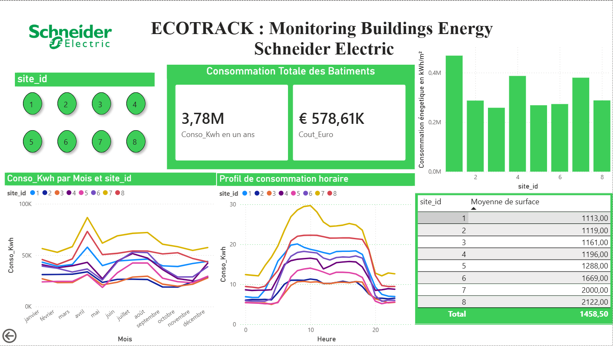

# EcoTrack : Schneider Electric Energy Monitoring

> **Projet Data Engineering & Analytics** basé sur les données Open Data de Schneider Electric.
> *Objectif : Identifier les passoires énergétiques et optimiser la consommation d'un parc de 8 bâtiments.*

## Liens & Ressources
- **Fichier Power BI :** [Télécharger le .pbix](./EcoTrack_Dashboard.pbix)
- **Code Python ETL :** [Voir le script](./etl_to_sql.py)
- **Base de donné MySQL:** [Voir l'image](./etl_to_sql.png)

---

##  Présentation du Projet (Méthode STAR)

### 1. Situation (Contexte)
Dans un contexte de crise énergétique et de régulations strictes (Décret Tertiaire), l'optimisation de la consommation électrique des bâtiments tertiaires est critique. J'ai analysé un jeu de données réel (36 000+ relevés) contenant la consommation de 8 supermarchés européens.

### 2. Task (Objectif)
Concevoir une architecture de données "Full Stack" pour répondre à deux questions métiers :
* Quels bâtiments sont les moins performants (ratio kWh/m²) ?
* Quel est l'impact financier de la surconsommation ?

### 3. Action (Réalisation Technique)
* **Data Engineering (Python & SQL) :** Création d'un pipeline ETL pour nettoyer les données brutes (Wh vers kWh), gérer les dates et charger le tout dans une base MySQL locale.
* **Data Analysis (KPIs) :** Calcul de l'intensité énergétique et estimation des coûts (Hypothèse : 0.15€/kWh).
* **Data Visualization (Power BI) :** Conception d'un tableau de bord interactif pour suivre la saisonnalité et les pics de charge (CVC).

### 4. Result (Impact)
* **Identification :** Le **Site 1** a été identifié comme le plus énergivore (moins performant) (400 kWh/m² ) et ** Le **Site 3** a été identifié comme le moins énergivore(plus performant) (400 kWh/m² ).
* **Finance :** Le coût total estimé est de **~578 k€**, avec un gisement d'économie potentiel de 10% par simple régulation.
* **Technique :** Déploiement d'une solution automatisée capable de traiter de nouveaux flux de données instantanément.

---

## 🛠 Stack Technique
| Outil | Usage |
| :--- | :--- |
| **Python (Pandas)** | ETL, Nettoyage des données, Calculs |
| **MySQL** | Stockage et requêtes SQL complexes |
| **Power BI** | Dashboarding, DAX, Storytelling |
| **Git / GitHub** | Versionning et Portfolio |

---
*Projet réalisé par TEMTSA GOUFFO - Étudiant Ingénieur 3ème année (EPF).*
*À la recherche d'une alternance Data Engineering/Data Science/Data Analysis pour Septembre 2026.*
